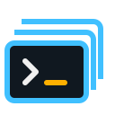
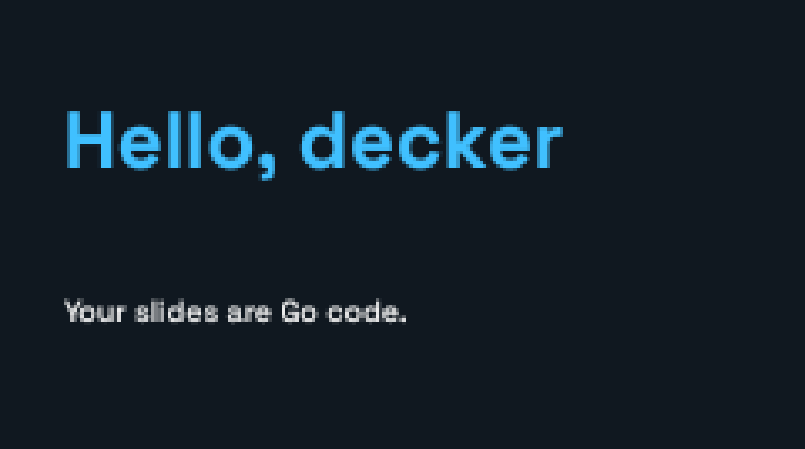
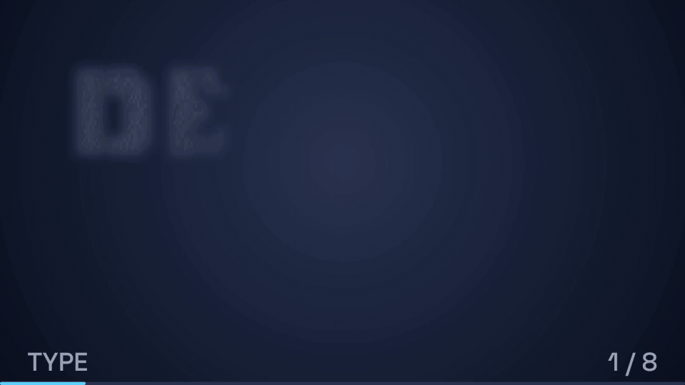
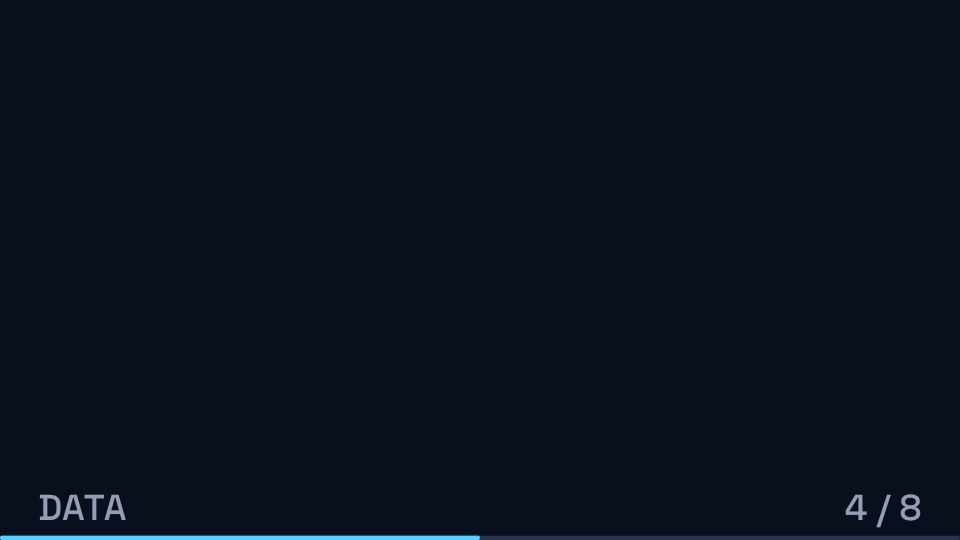
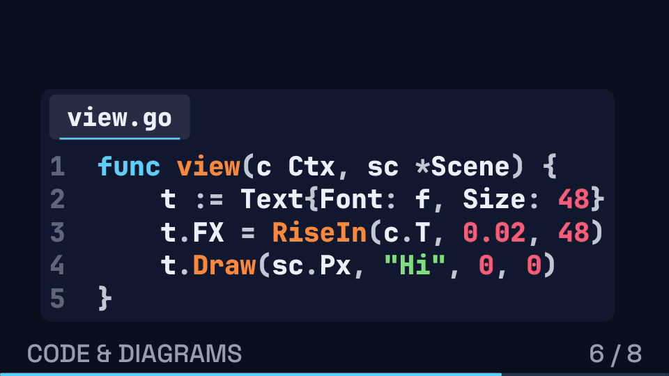

<p align="center">
  
</p>

# decker

**Slide decks as Go programs, presented in your terminal.**

[](https://github.com/austinlparker/decker/actions/workflows/ci.yml)
[](go.mod)
[](https://github.com/austinlparker/decker/tags)
[](https://pkg.go.dev/github.com/austinlparker/decker)
[](LICENSE)

Decker draws big antialiased type, block letters, diagrams and animation on a
pixel canvas displayed with terminal half-block characters. Your talk brings
its theme and slide functions; the engine provides navigation, build steps,
transitions, a presenter view, live reload, PNG snapshots and video export.

Built on [Bubble Tea](https://github.com/charmbracelet/bubbletea),
[Lip Gloss](https://github.com/charmbracelet/lipgloss) and
[Harmonica](https://github.com/charmbracelet/harmonica).

[Quick start](#quick-start) · [Guide](docs/guide.md) · [CLI](docs/cli.md) ·
[API reference](https://pkg.go.dev/github.com/austinlparker/decker) ·
[Troubleshooting](docs/troubleshooting.md) · [Contributing](CONTRIBUTING.md)



## What you can make

These clips are exported from the [showcase example](examples/showcase/main.go)
with decker's own `-video` mode. The same frames play live in the terminal.

**Type and letter effects:** block-letter titles, rich text, and per-letter
animations such as decode, wave, type-on and rain.



**Charts and numbers:** stats that count up, and line and donut charts that
build in on their step.



**Code, diagrams and magic move:** syntax-highlighted code with a focus that
walks between lines, connectors that draw on, and elements that glide to new
positions on the next slide.



## Requirements

- **Go 1.27.0 or later**, as specified in [go.mod](go.mod).
- **A Unix environment** for the engine's signals and dev process replacement.
  CI runs on Linux; use WSL for Windows. Native Windows builds are unsupported
  by the current implementation; macOS is not checked in CI.
- **A true-color terminal with Unicode half-block support** for live talks.
  Try Ghostty, kitty, WezTerm or iTerm2. A smaller terminal font gives smoother
  slides because it increases the pixel count.
- **FFmpeg with `libx264`**, only for video export. Snapshots, contact sheets
  and slide lists run without an interactive terminal.

Decker is a Go library. A talk is a separate `main` package that calls
`decker.Main`; decks are authored in Go, with their own layouts and assets.

## Quick start

Create a new talk module:

```sh
mkdir my-talk
cd my-talk
go mod init example.com/my-talk
go get github.com/austinlparker/decker@latest
```

Save this complete program as `main.go`:

```go
package main

import "github.com/austinlparker/decker"

func main() { decker.Main(talk()) }

func talk() decker.Deck {
	theme := &decker.Theme{
		Background: decker.Hex("#101820"),
		Text:       decker.Hex("#F0F0F0"),
		Muted:      decker.Hex("#A0A8B0"),
		Faint:      decker.Hex("#384048"),
		Accent:     decker.Hex("#40C0FF"),
		Accent2:    decker.Hex("#FFB000"),
		Warn:       decker.Hex("#FF6060"),
		Good:       decker.Hex("#70D050"),
		Panel:      decker.Hex("#0A1016"),
		Display:    decker.StockFont("SpaceGrotesk-Bold"),
		Body:       decker.StockFont("SpaceGrotesk-Medium"),
		Mono:       decker.StockFont("JetBrainsMono-ExtraBold"),
	}
	return decker.Deck{
		Name: "hello-decker", Theme: theme,
		Slides: []decker.Slide{{
			Title: "Hello, decker", Steps: 2,
			Notes: "Press space to reveal the second line. Press q to quit.",
			View: func(c decker.Ctx, sc *decker.Scene) {
				size, title := c.Theme.Display.Fit("Hello, decker", c.X(0.84), c.Y(0.3), c.Size(0.18), 0)
				decker.Text{Font: c.Theme.Display, Size: size, Color: c.Theme.Accent,
					FX: decker.RiseIn(c.T, 0.02, size)}.Draw(sc.Px, title, c.X(0.08), c.Y(0.2))
				if c.Reached(1) {
					decker.Text{Font: c.Theme.Body, Size: c.SmallText(c.Theme.Body), Color: c.Theme.Text,
						FX: decker.FadeUp(c.Since(1), 0.4, c.SmallText(c.Theme.Body))}.
						Draw(sc.Px, "Your slides are Go code.", c.X(0.08), c.Y(0.65))
				}
			},
		}},
	}
}
```

Run your talk:

```sh
go run .
```

You should see **Hello, decker** animate in. Press `space` to reveal the
second line, **Your slides are Go code.** Press `q` to quit. The three theme
fonts are required and are loaded once, outside the frame function.

Already have this repository checked out? Run the same
[hello example](examples/hello/main.go) from its root:

```sh
go run ./examples/hello
```

## Run, rehearse and export

These commands run from your talk's directory:

```sh
go run . -dev                         # rebuild on save; keep your slide and step
go run . -presenter -length 45m        # second window: notes, timer and previews
go run . -list                        # titles, step counts and sections
go run . -snapshot -step 2 -w 160 -h 45 -png frame.png
go run . -sheet sheet.png             # all slides at their final step
go run . -video talk.mp4 -fps 30       # silent video; needs ffmpeg
```

For the presenter view, keep the deck running in the first window and start
`-presenter` in the second. It connects using the deck's name and reconnects
after a dev rebuild. See the [CLI reference](docs/cli.md) for every flag,
default, export behavior and socket options.

| Key | Action |
| --- | --- |
| `space` / `→` / `pgdn` | Next build step or slide |
| `←` / `pgup` | Previous build step or slide |
| `]` / `[` | Next / previous slide, skipping builds |
| `12g` / `12` then `enter` | Jump to slide 12 |
| `r` | Replay this slide from its first step |
| `b` / `w` | Blank to black / white; press again to resume |
| `?` / `q` | Help / quit |

The [full key table](docs/guide.md#keys) includes clicker bindings and
presenter-only timer controls.

## Learn more

| Task | Documentation |
| --- | --- |
| Understand the canvas, fonts and presentation setup | [Rendering and type](docs/guide.md#how-it-draws-big-type-in-a-terminal) |
| Choose bundled block fonts or supply your own | [Choosing and loading fonts](docs/guide.md#choosing-and-loading-fonts) |
| Build a theme and your own slide templates | [Anatomy of a deck](docs/guide.md#anatomy-of-a-deck) |
| Find text, charts, shapes, code blocks and diagrams | [Toolbox](docs/guide.md#toolbox) and [API reference](https://pkg.go.dev/github.com/austinlparker/decker) |
| Animate builds and move elements between slides | [Element animations](docs/guide.md#element-animations) and [magic move](docs/guide.md#magic-move) |
| Test your talk and pin its rendered output | [Deck tests](docs/guide.md#tests) |
| Resolve setup, presenter or export problems | [Troubleshooting](docs/troubleshooting.md) |
| Change the engine | [Contributing](CONTRIBUTING.md), [invariants](AGENTS.md) and [file map](docs/architecture.md) |
| Understand versions and automated releases | [Releasing](docs/releasing.md) and [release notes](https://github.com/austinlparker/decker/releases) |

## Rendering contract

A frame depends only on `Ctx`: use `c.T`, `c.StepT`, `c.Since` and `Hash01`
for animation and noise. This lets replay, snapshots, video and golden tests
render the same moment. Go build indexes start at **0**; CLI slide and step
numbers start at **1**. `Steps: 2` means two build states.

Video uses the pixel canvas and has no audio. Native character-layer content
(`Scene.Text`, `Put`, `Sprite`) appears in terminal and PNG output, but is
omitted from video. Use `Text`, `Rich` or `Block` for text needed in every
output. See [export behavior](docs/cli.md#export-behavior).

## Licensing and assets

Decker's code, documentation, examples and [SVG icon](docs/assets/decker.svg)
use the [MIT license](LICENSE).

Bundled Space Grotesk and JetBrains Mono fonts remain under **SIL OFL 1.1**;
retain their notices when distributing them or binaries that embed them.
The five default FIGlet fonts are Spleen conversions under **BSD-2-Clause**;
five optional display-font conversions use **SIL OFL 1.1**. Select them with
`StockFigletFont`; enumerate choices with `StockFigletFontNames`. Consumers can
load their own fonts with `LoadFigletFont` or `ParseFigletFont`.
Third-party fonts keep their own terms separately from MIT; see the
[font inventory and license findings](fonts/README.md) for notices and provenance.
