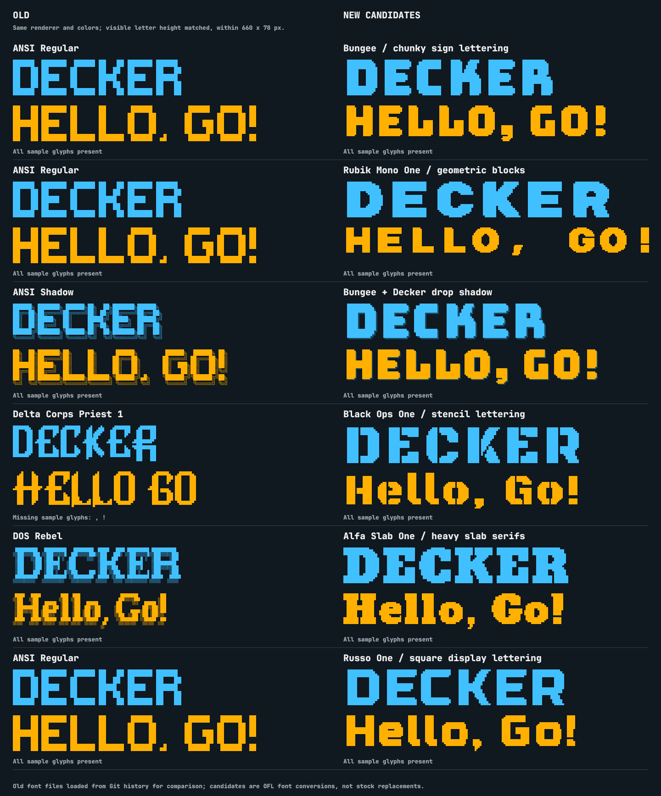
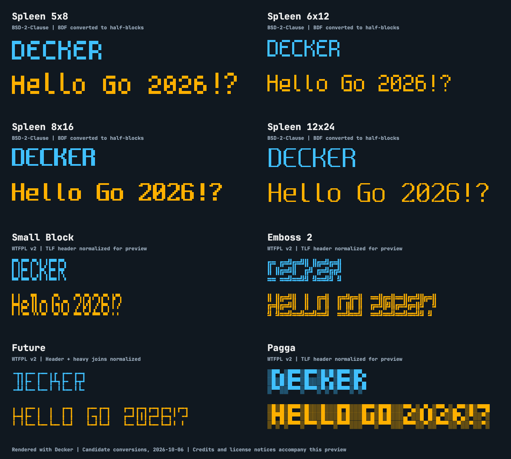

# Alternatives for the stock block fonts

Reviewed on 2026-10-06. The previous five FIGlet files had no explicit
redistribution grants and have now been replaced by Spleen. See the
[stock font mapping and conversion details](../fonts/figlet/README.md).
This shortlist uses
font authors' own license declarations and actual Decker renderings.

## Bold display alternatives

The old-versus-Spleen comparison showed that Spleen loses much of the
original fonts' weight and variety. The current preference is to preserve
the original display-lettering character. **Russo One** is the closest
candidate for ANSI Regular's square shapes; **Bungee** offers more weight.
**Black Ops One** and **Alfa Slab One** provide distinct stencil and serif
styles for the decorative roles. All five designs are now bundled as
optional fonts through `StockFigletFont`; see the [catalog and custom-font
examples](guide.md#choosing-and-loading-fonts). The five Spleen default
assignments remain unchanged.

The samples use Decker's actual `LoadFigletFont` and `Block.Draw`, with each
sample fitted to a 660×78 pixel box. Visible letter height is matched where
width permits. The left column loads the original files from Git history.
The right column converts the following OFL fonts to FIGlet half-blocks:

| Candidate | Resembles / useful role | Tradeoff | Font license |
| --- | --- | --- | --- |
| **Russo One** | ANSI Regular: square, restrained display lettering | Less chunky than Bungee; true lowercase differs from the original's uppercase shapes | [SIL OFL 1.1](https://github.com/google/fonts/blob/main/ofl/russoone/OFL.txt) |
| **Bungee** | Solid headings: thick sign lettering | Rounded corners; lowercase input has uppercase-shaped lettering | [SIL OFL 1.1](https://github.com/google/fonts/blob/main/ofl/bungee/OFL.txt) |
| **Bungee with `Block.Drop`** | A shadowed heading option | Simple offset shadow; does not reproduce ANSI Shadow's detailed outline | Same Bungee grant |
| **Rubik Mono One** | Very heavy geometric headlines | Wide, even character advances consume more space; uppercase-shaped lowercase | [SIL OFL 1.1](https://github.com/google/fonts/blob/main/ofl/rubikmonoone/OFL.txt) |
| **Black Ops One** | Delta Corps Priest: angular stencil headings | Military stencil style; true lowercase | [SIL OFL 1.1](https://github.com/google/fonts/blob/main/ofl/blackopsone/OFL.txt) |
| **Alfa Slab One** | DOS Rebel: heavy slab-serif headings | Solid silhouette rather than DOS Rebel's shaded texture | [SIL OFL 1.1](https://github.com/google/fonts/blob/main/ofl/alfaslabone/OFL.txt) |

These are converted outline fonts, not pre-existing native FIGlet designs.
The prototype conversion uses Pillow 12.3.0 with approximately 18 pixels of
capital ink height, a shared ASCII baseline and a grayscale threshold of
128. Each pair of vertical pixels becomes ` `, `▀`, `▄` or `█`. Glyphs retain
their own advances with FIGlet full-width layout. This works with the
existing renderer and introduces no runtime dependency. The visible
samples need roughly 9–12 FIGlet rows for these fonts, rather than ANSI
Regular's five, so check readability at your target terminal size. The
bundled conversions retain these prototype glyph shapes. The gallery
exercises each new face at three terminal sizes, without changing any
default font design.

All five shortlisted conversions passed checks that each of the 94
non-space printable ASCII glyphs both exists and paints pixels through
Decker. A space between letters increases the rendered width. This does
not establish readability at every terminal size. Bungee Shade was also
converted, but its thin outlines disappear at this resolution; it is not
recommended from that prototype.

The source TTF files and their own `OFL.txt` files were downloaded from
Google Fonts on 2026-10-06. Their exact SHA-256 hashes, conversion sizes and
copyright statements are recorded in [the source manifest](assets/display-font-sources.json).
The license texts and font metadata notices are retained in
[the notices file](assets/display-font-notices.txt). Black Ops One's TTF
copyright metadata names the PinyonScript project while its accompanying
OFL file names the Black-Ops project; both supplied notices are preserved.
Both files explicitly identify SIL OFL 1.1.

OFL permits modification and redistribution while requiring derived fonts
to remain under OFL and retain the notices. Alfa Slab One reserves
"Alfa Slab" and Russo One reserves "Russo"; prototype font names are
**Decker Slab** and **Decker Square**, with the originals credited as
sources. The other conversions also use distinct prototype names. The
project's MIT code license does not replace these font licenses.

## Earlier bitmap-font shortlist

Spleen was initially selected for its consistent pixel lettering and clear
BSD-2-Clause provenance. The 5×8, 6×12 and 8×16 sizes cover compact,
general-purpose and larger lettering from one family; its 12×24 variant
is thinner. The following comparison records that earlier shortlist.

**Small Block** is an alternative if preserving a narrow
Unicode-block appearance matters more than using one consistent family.
**Emboss 2** adds a distinct double-line outline style.

## Visual comparison

These are prototype conversions rendered with the checkout's `LoadFigletFont`
and `Block.Draw`. Each sample fits a 535×58 pixel box, preserving its aspect
ratio. This image records the research candidates before the stock fonts were
replaced; see the current mapping linked above.
Credits, adaptation details and full license texts accompany the image in
[the notices file](assets/figlet-alternatives-notices.txt).

| Candidate | Font license evidence | Fit for Decker | Work needed |
| --- | --- | --- | --- |
| **Spleen 5×8 / 6×12 / 8×16** | [Author's BSD-2-Clause license](https://github.com/fcambus/spleen/blob/master/LICENSE); matching declarations in the BDF files | Crisp solid pixels, true lowercase, digits and printable ASCII punctuation; one family at several resolutions | Convert BDF bitmaps to `.flf`, retaining copyright and BSD notices |
| **Spleen 12×24** | Same author and license | More detailed, thinner lettering; useful for larger headings | Same conversion; wider text needs more horizontal space |
| **Small Block** | [Explicit WTFPL v2 grant in the font header](https://github.com/cacalabs/toilet/blob/master/fonts/smblock.tlf) | Compact solid lettering with lowercase; four declared rows | Normalize `tlf2a` to `flf2a`; handle unsupported `▃` in the `<` glyph before replacing a stock font |
| **Emboss 2** | [Explicit WTFPL v2 grant in the font header](https://github.com/cacalabs/toilet/blob/master/fonts/emboss2.tlf) | Three-row double-line outline; a distinctive compact option | Normalize the header; supply or document missing punctuation `# $ % , ; < >` |
| **Future** | [Explicit WTFPL v2 grant in the font header](https://github.com/cacalabs/toilet/blob/master/fonts/future.tlf) | Three-row geometric outlines; lowercase is uppercase-shaped | Normalize the header and support or convert nine heavy box-drawing joins; missing `# < > ^` |
| **Pagga** | [Explicit WTFPL v2 grant in the font header](https://github.com/cacalabs/toilet/blob/master/fonts/pagga.tlf) | Three-row retro blocks on a shaded background; decorative option | Normalize the header; `/` and `\` strokes used by some glyphs, including `0` and `Q`, need conversion or renderer support |

WTFPL v2 permits redistribution and modification; the upstream
[full license text](https://github.com/cacalabs/toilet/blob/master/COPYING)
uses an intentionally profane name. These grants apply to the named font
files themselves, rather than being inferred from a renderer's license.
Spleen uses the more conventional BSD-2-Clause terms; retain its notice in
source and accompanying materials for binary distributions.

## Compatibility findings

Decker currently accepts `flf2a` headers and loads ASCII input glyphs only.
It paints selected Unicode blocks, shades and box-drawing characters into
pixels. Ordinary ASCII subcharacters such as `/`, `_` and `|` have no pixel
drawing implementation. Consequently, classic FIGlet **Standard**, **Big**
and **Slant** are poor replacements with the current renderer, even if a
font's license is acceptable.

The TOIlet candidates use `tlf2a` headers, so their original files cannot
be loaded unchanged. The preview normalized their headers in temporary
copies. Future also maps `┏┓┗┛┣┫┳┻╋` to their light equivalents in those
copies. Its preview therefore shows an adapted version, not the original
heavy joins. Other unsupported glyph strokes were left as-is to expose
the limitations, including Pagga's incomplete `0`.

For Spleen, each pair of vertical BDF bitmap pixels becomes one of
` `, `▀`, `▄` or `█` in a temporary `.flf` file. All 95 printable ASCII
input glyphs were present in all four reviewed sizes. Declared heights
after conversion are 4, 6, 8 and 12 FIGlet rows; Decker trims blank rows
when drawing. This preserves the bitmap design without adding drawing
code or importing a new runtime dependency.

## Current stock implementation

The selected stock fonts use Spleen 5×8, 6×12, 8×16 and 12×24, plus a
shaded 6×12 variant. The exported `BlockSmall`, `BlockSolid`, `BlockHuge`,
`BlockShadow` and `BlockFancy` identifiers remain available. Their font
names, measurements, case and appearance change, and ASCII quote marks
are preserved. The old font files are removed. Emboss 2, Future and Pagga
remain research candidates and are not bundled stock fonts.

Five optional OFL faces supplement those defaults: `Decker Sign`,
`Decker Geometric`, `Decker Stencil`, `Decker Slab` and `Decker Square`.
The [bundled source manifest](../fonts/figlet/display-sources.json),
[reproducible converter](../fonts/figlet/generate_display.py) and
[font inventory](../fonts/figlet/README.md#optional-display-fonts) record
their actual distribution names, generation settings and retained notices.
`StockFigletFontNames` lists all ten faces. Consumers can also supply their
own fonts through `LoadFigletFont` or `ParseFigletFont` and pass them directly
to `Block.Font` and `FitBlock`.

The [current stock preview](assets/stock-block-fonts.png) shows all five
Spleen variants, including the shaded conversion. Its font notices are
retained in [Spleen-LICENSE.txt](../fonts/figlet/Spleen-LICENSE.txt) and
[JetBrainsMono-OFL.txt](../fonts/JetBrainsMono-OFL.txt).

## Other candidates investigated

- [Kufont ASCII](https://github.com/acgaudette/kufont-ascii) is an original
  8×8 bitmap font with an explicit CC BY 4.0 declaration. It would need
  PBM-to-FIGlet conversion, author credit and adaptation notices. Its
  source bitmap is stored with Git LFS; it was not fetched or previewed.
- TOIlet's **Mono 9/12** variants fit the block renderer, but their headers
  only identify an automatic conversion from generic system font names.
  The underlying typeface and its license need tracing before choosing
  those generated files. They were not treated as cleared alternatives.
- TOIlet's **Letter** has an explicit font license but draws with ASCII
  letters and punctuation, which the block renderer does not paint.

Sources inspected locally at Spleen revision
`57f9219328c9f5873085320fe8bc8f7dd34b8791` and TOIlet revision
`3eb9d58037afb0a1baec6dca82caa045fb2217c0`. The preview compiled and ran
against the current checkout; font inventory, input coverage and drawing
character coverage were inspected separately.
